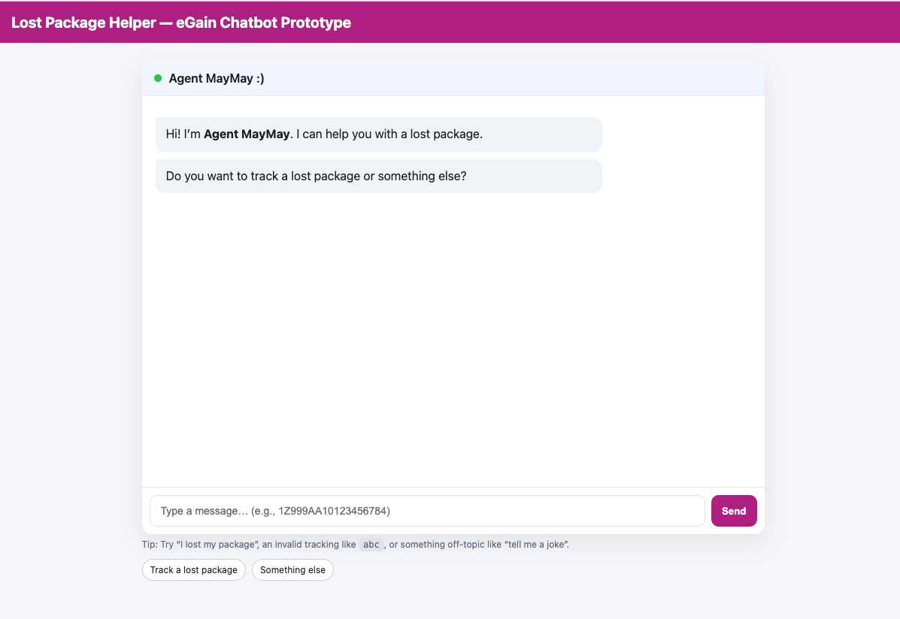
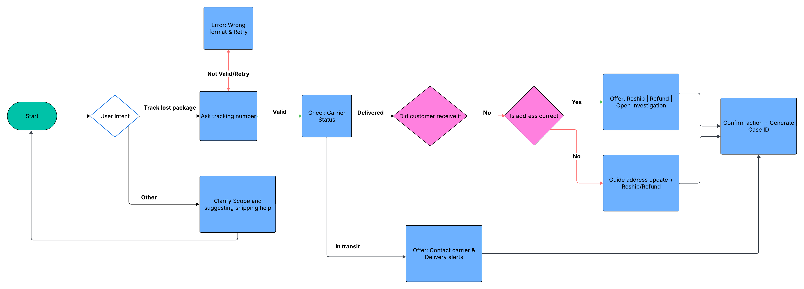
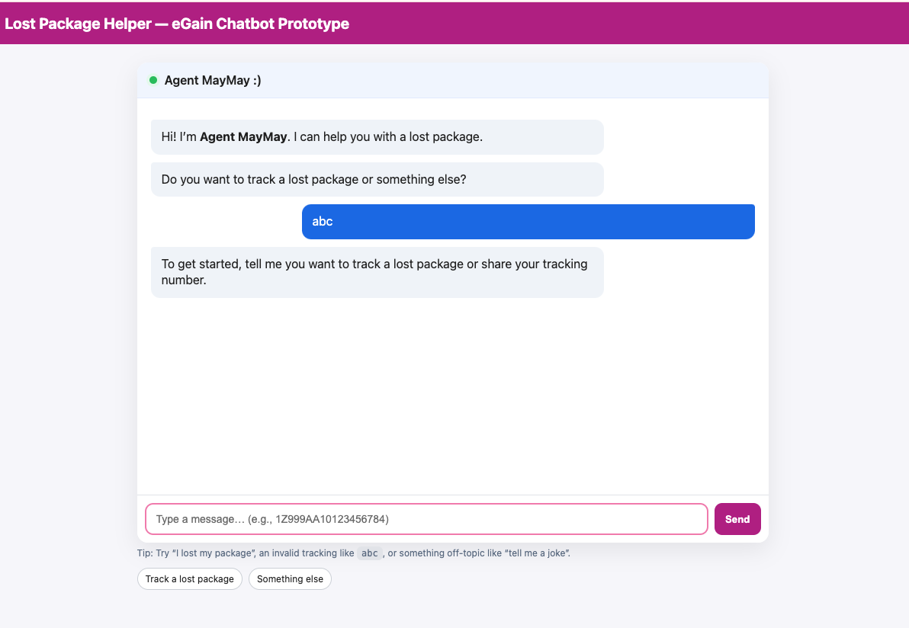

# Lost Package Helper — eGain SWE Take-Home

A lightweight, deterministic **customer support chatbot** for the **“lost package”** scenario.  
Built with **vanilla HTML/CSS/JS**. 

# Flowchart

---

## TL;DR

- **Run:** right click and open `index.html` in any modern browser.
- **Try:**  
  - `I lost my package`  
  - `abc` (invalid tracking → inline guidance)  
  - `1Z999AA10123456784` (valid-looking tracking)  
  - `tell me a joke` (off-topic → empathetic deflection)
- **Design goal:** **predictable, testable outcomes** with just enough free-text **breadth** to feel natural.

---

